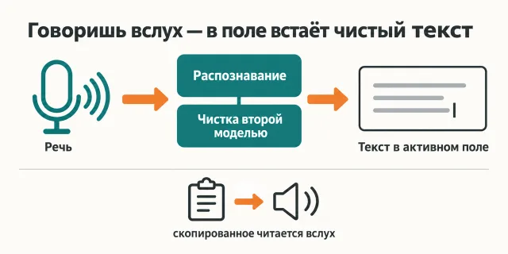
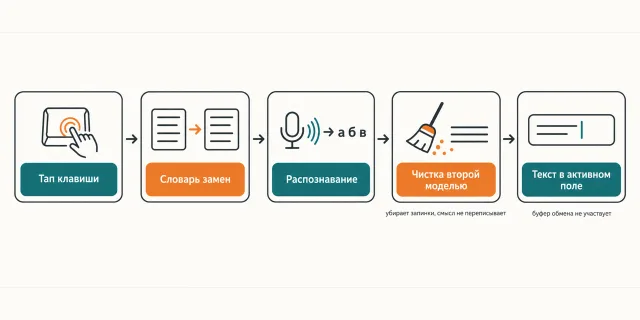

Русский · [English](README.en.md)

# Мысль длиной в абзац упирается в скорость пальцев — и приходит агенту вдвое короче, чем была

Ты говоришь вслух, вторая модель вычищает «э-э-э» и слова-паразиты, готовый текст сам встаёт
в поле, где стоит курсор. Скопированный текст читается вслух по тапу одной клавиши.

```
claude plugin marketplace add https://github.com/beCyborg/jadlis-hub
claude plugin install jadlis-voice@jadlis
```

Дальше одна команда — `/jadlis-voice` — и агент ведёт тебя по установке шаг за шагом.
Это третий шаг маршрута Jadlis: голос ставится после того, как агент уже установлен.



Текстом: слева речь, посередине распознавание и чистка второй моделью, справа готовый текст
в поле, где стоит курсор; ниже вторая ветка — скопированное читается вслух.

Это моё рабочее место, выложенное как есть, а не продукт: чем перестал пользоваться — убрал.

## Было → стало

| Руками | Чатом с ИИ | Этим плагином |
|---|---|---|
| **Как задание попадает агенту.** Печатаешь — и режешь мысль до той длины, которую не лень набрать. | Встроенная диктовка в чате есть, но пишет как слышит: с «э-э-э», повторами и без запятых. | Говоришь вслух, текст падает прямо в активное поле в режиме `autoInsert` — буфер обмена не участвует. |
| **Что происходит с распознанным текстом.** Вычитываешь и правишь сам, по одной запятой. | Ту же чистку просишь отдельным сообщением — и получаешь пересказ вместо своего текста. | Вторая модель убирает хезитации, фальстарты и слова-паразиты, ставит пунктуацию и не переписывает смысл: сокращать больше чем на треть ей запрещено промптом. |
| **Слова, на которых распознавание врёт всегда.** Правишь «Cloud Code» на «Claude Code» руками каждый раз. | Правишь руками там же, только медленнее. | Словарь из десяти пар «слышит → пишет» срабатывает до чистки; свои имена и проекты дописываешь по ходу. |
| **Как настраивается сам инструмент.** Двадцать пять переключателей в чужом приложении, каждый найти и понять. | Чат подскажет, где что лежит, дальше кликаешь сам. | 25 настроек, промпт корректора и словарь замен приезжают одним импортом; прежние настройки уходят в резервную копию. |
| **Длинный текст, который читать глазами лень.** Читаешь глазами или не читаешь вовсе. | Просишь пересказ — и теряешь оригинал. | Скопировал → тап правого Option → слушаешь оригинал целиком; тап ещё раз — замолкает. |

## Как это работает



На входе — твоя речь и тап правого Command; аккаунты у поставщиков и ключи заводишь ты, не плагин.
Внутри — словарь замен срабатывает до чистки, чистка правит запинки и пунктуацию и не переписывает
смысл.
На выходе — готовый текст в том поле, где стоит курсор.

Текстом: тап клавиши → словарь замен → распознавание → чистка второй моделью → текст в активном
поле.

Речь проходит два облачных шага и возвращается текстом туда, где стоит курсор:

1. **Правый Command** — нажал один раз: пошла запись, нажал второй: текст в поле (`toggle`).
2. **Словарь замен** — десять пар срабатывают ещё до чистки.
3. **Распознавание** — ElevenLabs `scribe_v2`: звук → буквы, со всеми «э-э-э».
4. **Чистка** — Anthropic `claude-sonnet-5`; при отказе подхватывает резерв OpenAI `gpt-5.6-sol`,
   если ключ для него заведён.
5. **Вставка** — готовый текст встаёт в активное поле сам.

Необязательная вторая ветка — озвучка: правило Karabiner ловит тап правого Option, `speak.sh`
берёт буфер обмена и читает его голосом ElevenLabs, звук выводит `play` из пакета sox.

Подробный разбор — [docs/tier/README.md](docs/tier/README.md), промпт корректора целиком —
[docs/prompt.txt](docs/prompt.txt).

## Установка и первый запуск

**а) Текст для вставки агенту.** Скопируй целиком в чат Claude Code:

```
Ты — установщик. Поставь на этот Mac плагин jadlis-voice из маркетплейса jadlis.
Выполни ровно эти команды, дословно, ничего не сокращая:
1. claude plugin marketplace add https://github.com/beCyborg/jadlis-hub
2. claude plugin install jadlis-voice@jadlis
3. claude plugin list — покажи мне строку про jadlis-voice и его версию.
Потом скажи мне одной строкой: набери /jadlis-voice — дальше плагин ведёт по шагам сам.
Ключи ElevenLabs и Anthropic спрашивает сам плагин на своём шаге, скрытым вводом:
их значения не печатай и в команды не подставляй.
Перед каждой командой покажи её мне целиком и дождись «да». Сказал «нет» — не выполняй,
скажи, что именно пропустил, и иди дальше.
Команда вернула ошибку — остановись, покажи вывод, к следующей не переходи.
```

**б) Команды руками.**

```
claude plugin marketplace add https://github.com/beCyborg/jadlis-hub
claude plugin install jadlis-voice@jadlis
claude plugin list
```

Первая команда ничего не ставит — она добавляет маркетплейс. Ставит только вторая, и снимается
она одной строкой: `claude plugin uninstall jadlis-voice@jadlis --keep-data`.

**в) Короткая команда.** Открой Claude Code и набери:

```
/jadlis-voice
```

Не находится — сверь имя строкой `claude plugin list`.

Команда `/jadlis-voice` ведёт по семи шагам, по одному действию за ход и всегда с разрешения:

1. **Проба** — что уже стоит: приложение, настройки, ключи (только имена), sox, Karabiner.
2. **Объяснение контура** — что такое распознавание, зачем вторая модель, что стоит денег.
3. **Ключи по одному** — ссылка на регистрацию, ты создаёшь ключ сам, вводишь скрытым вводом.
4. **`brew install --cask spokenly`** и первый запуск руками: разрешить Микрофон и Универсальный
   доступ. Это единственные шаги, которые нельзя сделать за тебя.
5. **Импорт настроек** — с закрытым Spokenly, с резервной копией, потом живая проверка: диктуешь
   «Cloud Code», в поле появляется «Claude Code».
6. **Озвучка, по желанию** — sox, Karabiner-Elements, `speak.sh` и одно правило на правый Option.
7. **Итог** — что изменилось и куда дальше.

Что нужно иметь: **macOS 13 (Ventura) и новее** — так требует каск Spokenly; ключ **ElevenLabs**
(распознавание и озвучка) и ключ **Anthropic API** из Console — это отдельный счёт, подписка на
Claude сюда не подходит. Необязательно: ключ **OpenAI** как резерв чистки, а для озвучки —
**sox** и **Karabiner-Elements**.

Ключи живут в Связке ключей macOS (service `jadlis`, account = имя ключа) — тот же стандарт, что
у `jadlis-search`. Значение вводится скрытым вводом, аргументом командной строки не передаётся
и в ответы агента не попадает.

## Границы, стоимость, обновление

**Чего не делает.** Не заводит за тебя аккаунты и не заполняет формы — даёт ссылку, регистрируешься
сам. Не переводит, не пересказывает и не сокращает больше чем на треть — это чистка, а не
переписывание. Не работает без интернета: голос уходит в ElevenLabs, текст — в Anthropic.
Не существует вне macOS. Приложение Spokenly есть и на iPhone, но настройка там своя и отдельная.

**Чего не трогает.** Ничего, кроме своего: настройки Spokenly (с резервной копией в `~/Archive/`),
запись в Связке ключей под service `jadlis`, файл `~/.local/bin/speak.sh` и **одно** правило
в конфиге Karabiner — оно опознаётся по описанию, повторный запуск дубля не создаёт. Чужие
правила, профили, ключи и репозитории остаются как были.

**Что стоит денег.** Распознавание тарифицируется по минутам записи, чистка — по объёму текста;
на бытовом объёме диктовки обе суммы маленькие. Оплата по факту, подписки нет, но минимальное
пополнение счёта нужно у каждого провайдера. Точные цифры смотри на страницах тарифов ElevenLabs,
Anthropic и OpenAI — здесь они устареют раньше, чем ты их прочитаешь. Само приложение на своих
ключах бесплатное.

**Про ключи в чужом файле.** Spokenly хранит ключи в своём файле настроек открытым текстом —
своего канала в Связку ключей он не даёт. Поэтому `~/Library/Preferences/app.spokenly.plist`
не пересылай, в репозиторий не клади и агенту читать не давай. Шаблон в `assets/` держит на месте
ключей плейсхолдеры, подстановка происходит только на твоей машине.

Spokenly — стороннее бесплатное приложение с необязательной подпиской Pro; к этому плагину его
авторы отношения не имеют.

**Проверено там, где я работаю:** мой Mac, мои ключи. Только macOS: контур собран из каска
Spokenly, Связки ключей и правила Karabiner, других систем я не проверял.

**Условия использования.** Лицензии нет: все права сохранены за автором. Читать и
пользоваться лично можно. Коммерческое использование, переиздание и включение в свои
продукты — по договорённости со мной.

**Обновление.** У стороннего маркетплейса авто-обновление на твоей стороне выключено: пока не
запустишь первую команду, у тебя остаётся та версия, которую ты поставил.

```
claude plugin marketplace update jadlis
claude plugin update jadlis-voice@jadlis
claude plugin list
```

Переустановка, если что-то встало криво:

```
claude plugin uninstall jadlis-voice@jadlis --keep-data && claude plugin install jadlis-voice@jadlis
```
